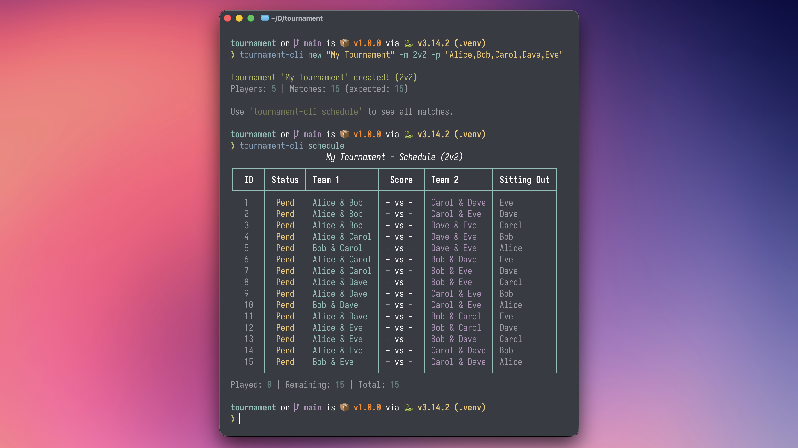
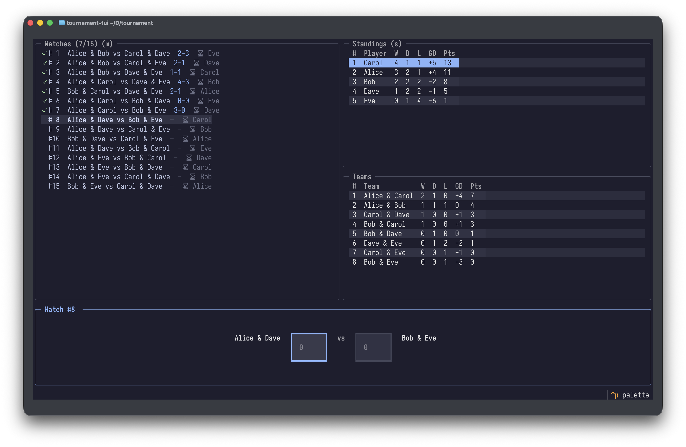
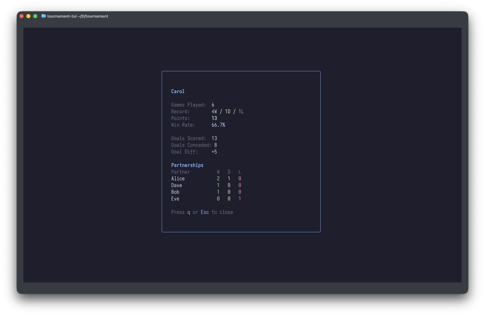

# Tournament CLI



A command-line tool for managing tournaments with flexible team sizes (1v1, 2v2, 1v2, 3v3, and more). Originally built for FIFA gaming sessions with friends, but works for any score based competition format.

This project is in large parts coded by Claude Code (Opus 4.5).

## Features

- **Flexible matchmaking**: Supports 1v1, 2v2, 1v2 (handicap), 3v3, and custom modes. Automatically generates all possible matchups where every player plays with and against everyone else
- **Interactive TUI**: Full-screen terminal interface with keyboard navigation, live standings, and player stats modals
- **Player standings**: Track wins, draws, losses, goals, and points with automatic ranking
- **Team rankings**: See which player pairings perform best together
- **Player statistics**: Detailed stats including partnership performance with each teammate
- **Export**: Generate tournament summaries in Markdown or styled PDF format

## Installation

### From GitHub Releases (Recommended)

Download the latest binary for your platform from the [Releases](https://github.com/strehk/tournament-cli/releases) page:

- **macOS (Apple Silicon)**: `tournament-cli-macos-arm64`
- **macOS (Intel)**: `tournament-cli-macos-x86_64`
- **Linux**: `tournament-cli-linux-x86_64`
- **Windows**: `tournament-cli-windows-x86_64.exe`

Make the binary executable (macOS/Linux):

```bash
chmod +x tournament-cli-*
./tournament-cli-macos-arm64 --help
```

### From Source

Requires Python 3.9+

```bash
git clone https://github.com/strehk/tournament-cli.git
cd tournament-cli
pip install -e .
```

## Quick Start

### 1. Create a tournament

```bash
# Using interactive player entry
tournament-cli new "Game Night" --mode 2v2

# Or provide players directly (skip prompts)
tournament-cli new "Game Night" -m 2v2 -p "Alice,Bob,Carol,Dave"
```

The `--mode` (`-m`) flag is required. Use `--players` (`-p`) to skip the interactive prompt.

### 2. Play matches

```bash
tournament-cli play
```

This shows the next match and prompts for scores. You can also play a specific match:

```bash
tournament-cli play 5  # Play match #5
```

### 3. View standings

```bash
tournament-cli standings
```

### 4. View team rankings

```bash
tournament-cli teams
```

### 5. Export results

```bash
tournament-cli export           # Markdown
tournament-cli export --pdf     # PDF
```

## Usage Examples

Real-world scenarios for your gaming sessions.

### Classic 2v2 with 4 Players

Friday FIFA night with the usual crew. Everyone plays with and against everyone.

```bash
# Interactive player entry
tournament-cli new "Friday FIFA" -m 2v2

# Or skip the prompts
tournament-cli new "Friday FIFA" -m 2v2 -p "Marcus,Dennis,Kevin,Steve"
```

3 matches total - perfect for a quick session.

### 2v2 with 5 Players (One Sits Out)

Fifth wheel shows up uninvited. Someone rotates out each match.

```bash
tournament-cli new "Awkward Fifth" -m 2v2 -p "Alice,Bob,Carol,Dave,Eve"
```

15 matches total - the CLI handles rotation automatically.

### 1v2 Handicap Mode (3 Players)

That one friend who's "too good" plays solo against a duo. Nobody waits, everyone plays every match.

```bash
tournament-cli new "Humble Marcus" -m 1v2 -p "Marcus,Dennis,Kevin"
```

Great for uneven skill levels - 3 players minimum.

### 1v1 Duel (2 Players)

Just two rivals settling the score. No teammates to blame.

```bash
tournament-cli new "The Reckoning" -m 1v1 -p "Marcus,Dennis"
```

Single match, winner takes bragging rights.

### 1v1 with Pre-formed Teams (Workaround)

Couples tournament - 4 pairs compete as units.

**Trick:** Enter team names as "players" instead of individual names.

```bash
tournament-cli new "Couples Clash" -m 1v1 -p "Tom+Sarah,The Couch Potatoes,Team No Sleep,Night Owls"
```

### 3v3 Mode (6 Players)

Rocket League night - full 3v3 chaos.

```bash
tournament-cli new "Rocket Night" -m 3v3 -p "Alice,Bob,Carol,Dave,Eve,Frank"
```

Everyone plays with and against everyone.

### Double Header (--rounds 2)

Nobody wants the night to end. Run the whole schedule twice.

```bash
tournament-cli new "Marathon Night" -m 2v2 -p "Alice,Bob,Carol,Dave" --rounds 2
```

Use `add-round` mid-tournament if you decide to extend.

## Commands Reference

| Command                | Description                     |
| ---------------------- | ------------------------------- |
| `new <name> -m <mode>` | Create a new tournament         |
| `list`                 | List all saved tournaments      |
| `load <name>`          | Load an existing tournament     |
| `status`               | Show tournament overview        |
| `schedule`             | Show all matches                |
| `schedule -r`          | Show only remaining matches     |
| `play [id]`            | Record a match result           |
| `standings`            | Show player rankings            |
| `teams`                | Show team (pair) rankings       |
| `stats <player>`       | Show detailed player statistics |
| `reset`                | Reset all match results         |
| `export`               | Export to Markdown              |
| `export --pdf`         | Export to PDF                   |
| `tui`                  | Launch interactive TUI          |

## Interactive TUI

Launch the full-screen terminal interface for a more visual experience:

```bash
tournament-cli tui
```

The TUI provides a lazygit-inspired interface with multiple panels showing matches, standings, team stats, and score entry simultaneously.

### Panels

| Panel           | Description                                                                     |
| --------------- | ------------------------------------------------------------------------------- |
| **Matches**     | Scrollable list of all matches with status indicators (✓ for played) and scores |
| **Standings**   | Player rankings table - select a player and press Enter for detailed stats      |
| **Teams**       | Team (pair) performance rankings (display only, 2v2+ modes)                     |
| **Score Entry** | Input fields for recording match scores                                         |

### Keyboard Shortcuts

| Key       | Action                                                                                        |
| --------- | --------------------------------------------------------------------------------------------- |
| `m`       | Focus matches panel                                                                           |
| `s`       | Focus standings panel                                                                         |
| `i`       | Focus score input                                                                             |
| `Tab`     | Cycle between panels                                                                          |
| `j` / `↓` | Navigate down in focused panel                                                                |
| `k` / `↑` | Navigate up in focused panel                                                                  |
| `Enter`   | Context-sensitive: jump to input (matches), open player stats (standings), save score (input) |
| `n`       | Jump to next unplayed match                                                                   |
| `r`       | Refresh tournament data from disk                                                             |
| `q`       | Quit                                                                                          |

### Player Stats Modal

When viewing standings, select a player with `j`/`k` and press `Enter` to view detailed statistics:

- Games played, win/draw/loss record
- Points and win rate percentage
- Goals scored, conceded, and goal difference
- Partnership stats showing performance with each teammate (in team modes)

Press `q` or `Esc` to close the modal.

## Screenshots

### Interactive TUI

The main TUI screen with matches, standings, teams, and score entry panels:



Player stats modal showing detailed statistics and partnership performance:



### Export Samples

Export your tournament to Markdown or PDF format with `tournament-cli export` or `tournament-cli export --pdf`.

<details>
<summary>Markdown Export Sample</summary>

```markdown
# Awkward Fifth

**Mode:** 2v2 | **Players:** 5 | **Matches:** 7/15 | **Progress:** 47%

_Exported: 2026-01-26 02:16_

---

## Standings

|  #  | Player    |  P  |  W  |  D  |  L  | GF  | GA  | GD  |  Pts   | Win% |
| :-: | --------- | :-: | :-: | :-: | :-: | :-: | :-: | :-: | :----: | :--: |
| 🥇  | **Carol** |  6  |  4  |  1  |  1  | 13  |  8  | +5  | **13** | 67%  |
| 🥈  | **Alice** |  6  |  3  |  2  |  1  | 12  |  8  | +4  | **11** | 50%  |
| 🥉  | **Bob**   |  6  |  2  |  2  |  2  |  7  |  9  | -2  | **8**  | 33%  |
|  4  | **Dave**  |  5  |  1  |  2  |  2  |  8  |  9  | -1  | **5**  | 20%  |
|  5  | **Eve**   |  5  |  0  |  1  |  4  |  6  | 12  | -6  | **1**  |  0%  |

---

## Best Teams

|  #  | Team              |  P  |  W  |  D  |  L  | GF  | GA  | GD  |  Pts  | Win% |
| :-: | ----------------- | :-: | :-: | :-: | :-: | :-: | :-: | :-: | :---: | :--: |
| 🥇  | **Alice & Carol** |  3  |  2  |  1  |  0  |  7  |  3  | +4  | **7** | 67%  |
| 🥈  | **Alice & Bob**   |  3  |  1  |  1  |  1  |  5  |  5  |  0  | **4** | 33%  |
| 🥉  | **Carol & Dave**  |  1  |  1  |  0  |  0  |  3  |  2  | +1  | **3** | 100% |

...
```

</details>

<details>
<summary>PDF Export Sample</summary>


</details>

## How It Works

For a 2v2 tournament with `n` players, the CLI generates all possible matchups where:

- Every player plays **with** every other player as teammates
- Every player plays **against** every other player as opponents

Total matches = `n(n-1)(n-2)(n-3) / 8`

| Players | Matches |
| ------- | ------- |
| 4       | 3       |
| 5       | 15      |
| 6       | 45      |
| 7       | 105     |
| 8       | 210     |

## Scoring

- **Win**: 3 points
- **Draw**: 1 point
- **Loss**: 0 points

Rankings are sorted by: Points > Goal Difference > Goals Scored

## Development

### Setup

```bash
git clone https://github.com/strehk/tournament-cli.git
cd tournament-cli
python -m venv .venv
source .venv/bin/activate  # or `.venv\Scripts\activate` on Windows
pip install -e .
```

### Running

```bash
tournament-cli --help
```

### Building Binaries

```bash
pip install pyinstaller
pyinstaller tournament-cli.spec
```

The binary will be in `dist/tournament-cli`.

## License

MIT License - see [LICENSE](LICENSE) for details.
